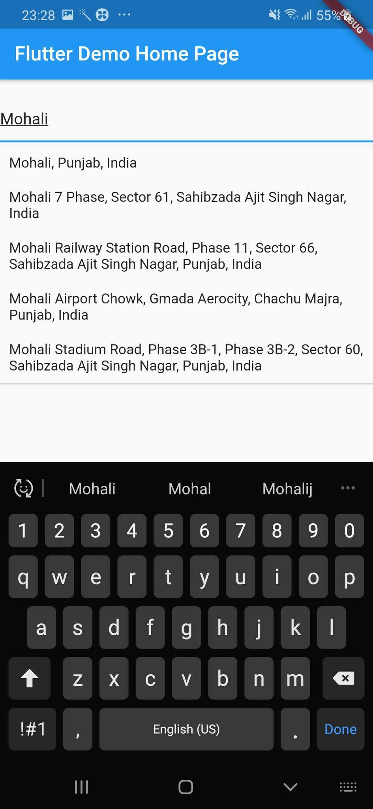

# google_places_flutter

# Add dependency into pubspec.yml

```
dependencies:
  flutter:
    sdk: flutter
  google_places_flutter: <last-version>
  
```  

# Google AutoComplete TextField Widget code

```
    GooglePlaceAutoCompleteTextField(
        textEditingController: controller,
        googleAPIKey: "YOUR_GOOGLE_API_KEY",
        inputDecoration: InputDecoration()
        debounceTime: 800 // default 600 ms,
        countries: ["in","fr"],// optional by default null is set
        isLatLngRequired:true,// if you required coordinates from place detail
        getPlaceDetailWithLatLng: (Prediction prediction) {
         // this method will return latlng with place detail
        print("placeDetails" + prediction.lng.toString());
        }, // this callback is called when isLatLngRequired is true
        itmClick: (Prediction prediction) {
         controller.text=prediction.description;
          controller.selection = TextSelection.fromPosition(TextPosition(offset: prediction.description.length));
        }
        // if we want to make custom list item builder
        itemBuilder: (context, index, Prediction prediction) {
          return Container(
            padding: EdgeInsets.all(10),
            child: Row(
              children: [
                Icon(Icons.location_on),
                SizedBox(
                  width: 7,
                ),
                Expanded(child: Text("${prediction.description??""}"))
              ],
            ),
          );
        }
        // if you want to add seperator between list items
        seperatedBuilder: Divider(),
        // want to show close icon 
        isCrossBtnShown: true,
        // optional container padding
         containerHorizontalPadding: 10,
         
         
        
        
    )
    
```

# Customization Option

You can customize a text field input decoration and debounce time

# Screenshorts



